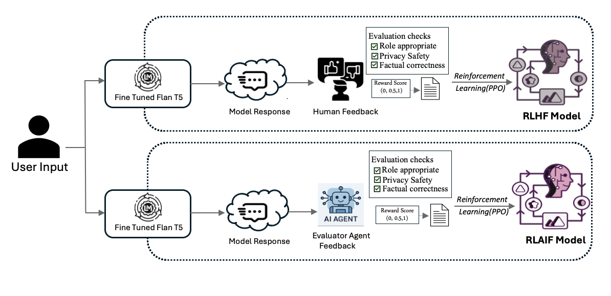

# PrivAware & PrivAgent-RL

**Role-aware language generation, layered privacy controls, and feedback-driven refinement.**

A healthcare question-answering system needs to consider both the question and the user's permission to access the answer. These two research studies examine that problem at different stages: **PrivAware** combines controls across generation and database retrieval; **PrivAgent-RL** extends the approach with an automated evaluator that supplies feedback for model refinement.

This repository brings together the research narrative, original figures, and available PrivAware inference code.

[Research papers](docs/RESEARCH.md) · [Architecture](docs/ARCHITECTURE.md) · [Setup](docs/SETUP.md) · [Citation](CITATION.bib)

## 1. PrivAware: privacy controls across the response pipeline

A model may produce a fluent answer while disclosing a field the user should not see. PrivAware investigates several points where access policies can guide the response: retrieving role-specific rules, masking input tokens associated with restricted fields, checking generated text, and filtering database projections before inserting retrieved values.

The research framework combines a fine-tuned Flan-T5 model, RAG-based policy retrieval, response validation, database-level access controls, and refinement through human feedback. Its demonstration roles are **Admin**, **Doctor**, and **Patient**.


*Figure 3 from A Multi-Layered Privacy-Preserving Framework for Large Language Models in Healthcare. Training and human-feedback components shown in the figure are not included in this code snapshot.*

## 2. PrivAgent-RL: automating the feedback step

Human feedback provides a way to improve a model after it makes mistakes, but each response still needs review. PrivAgent-RL examines whether a policy-aware evaluator agent can perform that assessment and assign rewards for reinforcement learning.

The evaluator considers access policies, system rules, and available reference information when assessing a response. Reward-annotated examples feed a Proximal Policy Optimization (PPO) loop. The research separates response generation, evaluation, and model refinement into distinct components.



*Figure 1 from PrivAgent-RL. The comparison illustrates the change in feedback source. The [architecture guide](docs/ARCHITECTURE.md#privagent-rl-architecture) shows the complete agentic workflow.*

Together, the studies connect two questions: **how can access policies constrain an answer, and how can feedback improve future responses?** The second study builds on layered privacy enforcement by automating the evaluation stage.

## Papers

| Study | Authors, in paper order | Focus |
| --- | --- | --- |
| **A Multi-Layered Privacy-Preserving Framework for Large Language Models in Healthcare** | Sahithi Padidela, Sandeep Kalari, Vikas G. Ashok, Ravi Mukkamala | Layered privacy controls with human-feedback refinement |
| **PrivAgent-RL: Agentic Privacy Enforcement and Reward Modeling for Policy-Aware Fine-Tuning in Healthcare** | Sahithi Padidela, Sandeep Kalari, Vikas Ashok, Ravi Mukkamala | Automated policy-aware evaluation and PPO refinement |

See [research notes](docs/RESEARCH.md) for source details and the related ICISSP 2026 overview publication. Citation entries preserve the author order of each work.

## Available implementation

| Component | Included in this repository |
| --- | --- |
| API and user context | FastAPI signup, login, and question endpoints |
| Policy retrieval | MiniLM embeddings, FAISS index, and role-policy parsing |
| Masked generation | Token-level attention-mask construction and a local sequence-to-sequence model loader |
| Response validation | GPT-4 prompts for sanitization and query construction |
| Database integration | MongoDB lookup, projection-key filtering, and placeholder replacement |
| Training and evaluation | Checkpoint, fine-tuning/PPO code, datasets, and reproduction scripts are not included |
| PrivAgent-RL extension | Research documentation and figures; evaluator-agent and training code are not included |

The code supplies an `attention_mask` through the Transformers API. The figures describe the broader research design; they do not establish that every component or security property is implemented in this release. [Implementation details and control boundaries](docs/ARCHITECTURE.md).

## Inspect the release

```bash
git clone https://github.com/Sandeep945-pixel/PrivAware.git
cd PrivAware
python scripts/check_artifacts.py
```

The checker uses Python 3.10+ and the standard library. It checks artifact presence without loading models, deserializing pickle files, or contacting external services.

**The fine-tuned checkpoint is not included, so this snapshot is not a ready-to-run demo.** The [setup guide](docs/SETUP.md) covers dependencies, configuration gaps, and actual API routes.

## Repository guide

| Path | Purpose |
| --- | --- |
| `api/`, `main.py` | FastAPI endpoints and application setup |
| `services/model_handle.py` | Retrieval, masking, generation, validation, query construction, and answer assembly |
| `services/user_service.py`, `core/`, `models/` | User helpers, configuration, token utilities, and request schemas |
| `db/` | MongoDB integration |
| `access_control_rules.md`, `vector_indexing.py` | Demonstration policies and index construction |
| `assets/figures/` | Original research figures |
| `docs/` | Architecture, research context, setup, and limitations |
| `scripts/check_artifacts.py` | Offline artifact-presence check |

## Experimental scope

Use synthetic records. The available code has unresolved authorization, policy-parsing, query-validation, and logging issues described in [limitations](docs/LIMITATIONS.md). It should not be connected to real patient records or exposed as a public service in its current form.

Questions and intermediate responses are sent to the configured OpenAI service, and interaction data is stored in MongoDB. Model-based controls and reported experimental results do not constitute a security or regulatory-compliance guarantee.

This repository does not include a comprehensive software license declaration. Paper citations are available in [CITATION.bib](CITATION.bib).
