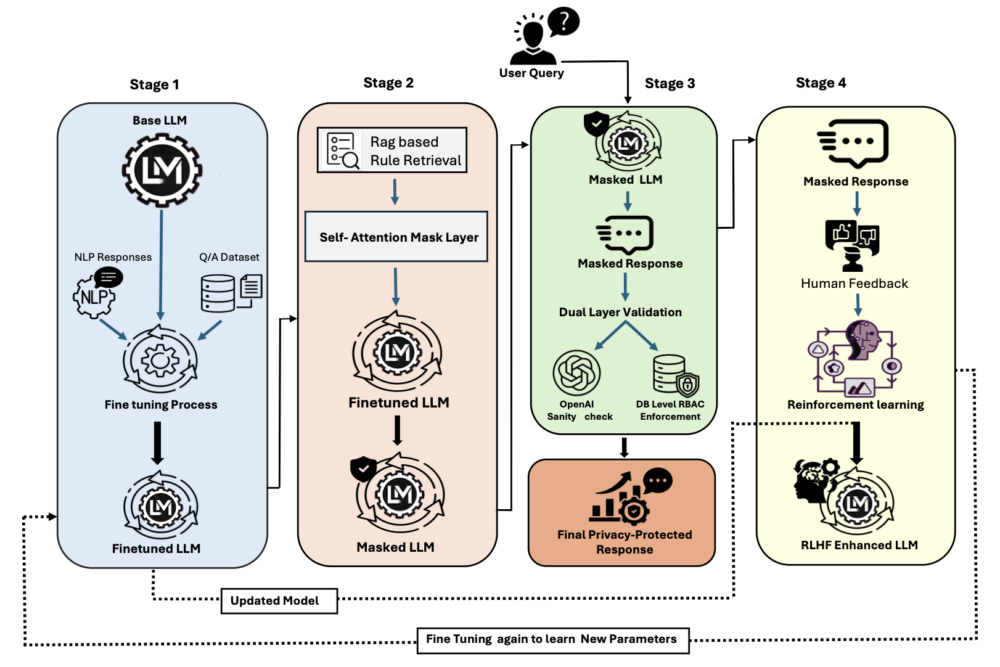

# PrivAware

**Role-aware information access for language-model applications.**

PrivAware explores how access policies can influence both language generation and database-backed answers. The healthcare research prototype combines role-policy retrieval, token-level attention masking, a second model for response sanitization, and field filtering before database lookup.

[Related paper — ICISSP 2026](https://doi.org/10.5220/0014218400004061) · [Architecture](docs/ARCHITECTURE.md) · [Setup and artifacts](docs/SETUP.md) · [Research notes](docs/RESEARCH.md)

## Contribution

Sandeep Kalari contributed research guidance and project support to this collaborative project.

## The problem

A natural-language interface to structured records must distinguish what a user asks from what that user is permitted to access. A plausible answer is not sufficient: the system also needs to constrain which fields it queries and which values it returns.

PrivAware investigates these controls at several stages of a question-answering workflow. The repository includes demonstration policies for **Admin**, **Doctor**, and **Patient** roles. These are experimental policies, not a universal definition of clinical access rights.

## Methodology



*Research methodology supplied by the project team. The figure includes training and human-feedback stages; their code and artifacts are not included in this repository.*

## Implementation overview

| Layer | Implementation |
| --- | --- |
| Policy retrieval | MiniLM embeddings and FAISS retrieve candidate policy chunks; code looks for a matching role |
| Mask construction | Exact matching and embedding similarity between input tokens and restricted field names produce a binary attention mask |
| Local generation | A separately supplied fine-tuned sequence-to-sequence checkpoint generates an initial response |
| Response sanitization | GPT-4 is prompted to remove restricted content and represent allowed database values as placeholders |
| Database access | A generated query is filtered against allowed projection fields before execution |
| Answer assembly | Returned values replace matching placeholders |

The local generation call supplies an `attention_mask` through the Transformers API. The repository does not contain a custom attention implementation or establish that restricted information becomes inaccessible to all model computation. See [architecture and control boundaries](docs/ARCHITECTURE.md).

## Start here

```bash
git clone https://github.com/Sandeep945-pixel/PrivAware.git
cd PrivAware
python scripts/check_artifacts.py
```

Use Python 3.10 or later for the new artifact checker. It runs with the standard library, makes no network requests, and does not load models or deserialize the bundled pickle file.

**This release is a research code snapshot, not a ready-to-run demo.** The required `new_fine_tuned_model/` checkpoint is not included. The checker reports missing local artifacts; it does not certify model compatibility, privacy protection, or runtime readiness.

The [setup guide](docs/SETUP.md) identifies dependencies, configuration gaps, actual API routes, and what is needed to run a controlled synthetic experiment. Replacing the missing checkpoint with a generic base model would not reproduce PrivAware.

## Research context

PrivAware is discussed alongside BlockQwen in **Exploring Large Language Models for Trustworthy Use: Insights from Research and Development**, by Sandeep Kalari, Sahithi Padidela, Vikas Ashok, and Ravi Mukkamala, published at ICISSP 2026. [ODU publication record](https://digitalcommons.odu.edu/computerscience_fac_pubs/452/).

Training code, a PPO/RLHF loop, evaluation datasets, and benchmark reproduction scripts are not included in this snapshot. Numerical results are not presented as verified measurements of this release. [Research and artifact status](docs/RESEARCH.md) explains the distinction.

## Repository guide

| Path | Purpose |
| --- | --- |
| `main.py` | FastAPI application and router registration |
| `api/` | Signup, login, and question endpoints |
| `services/model_handle.py` | Policy retrieval, masking, generation, sanitization, query construction, and answer assembly |
| `services/user_service.py` | User creation and authentication helpers |
| `core/` | Configuration and token/password utilities |
| `db/` | MongoDB collections |
| `models/` | Request schemas |
| `access_control_rules.md` | Demonstration role policies |
| `vector_indexing.py` | Build the FAISS rule index and chunk mapping |
| `scripts/check_artifacts.py` | Offline inspection of required artifact presence |

## Scope and responsible use

Use synthetic records for experimentation. This snapshot has unresolved authorization, query-validation, policy-parsing, and logging issues documented in [release limitations](docs/LIMITATIONS.md). Do not connect it to real patient records or expose it as a public service in its current form.

The workflow sends questions and intermediate responses to the configured OpenAI service and stores request/response information in MongoDB. Attention masking and model-based sanitization are research mechanisms, not a security or regulatory-compliance guarantee.

## Citation

For the related publication, use [CITATION.bib](CITATION.bib). Its publication license does not automatically license this repository's code, model weights, or datasets; this snapshot does not include a comprehensive software license declaration.
