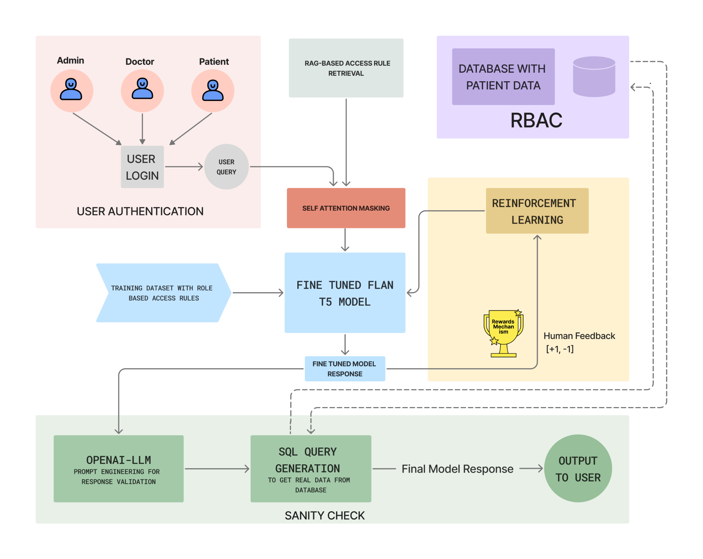
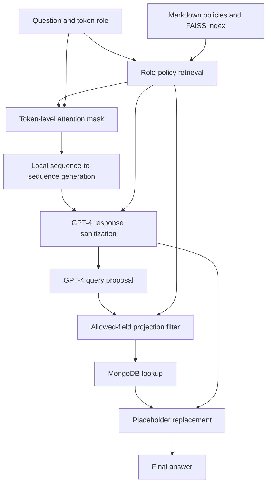

# Architecture and control boundaries

## Research architecture

*Research architecture supplied by the project team. The figure labels query generation as SQL; the checked-in implementation generates MongoDB filters and projections. Training and reinforcement-learning components shown here are outside the available source snapshot.*

## Available inference workflow

*This flow follows the checked-in code. The sections below describe its implementation and control boundaries.*

## Authentication and role context

The FastAPI application exposes signup and login endpoints. Login issues an HS256 token containing the username and role. The question endpoint reads those claims and prefixes the question with the role before generation.

The current signup schema accepts a role supplied by the caller. Token validation therefore does not by itself establish that the user was authorized to hold that role.

## Policy retrieval

`vector_indexing.py` splits the Markdown policy by separators, embeds the chunks using `all-MiniLM-L6-v2`, and builds a FAISS `IndexFlatL2` index. The runtime requests three candidate chunks and searches them for the role label.

When no exact role matches, the current implementation falls back to a retrieved chunk. Authorization-sensitive lookup should instead reject unknown or unmatched roles. Retrieved text is parsed into allowed and restricted field lists.

The Patient policy uses inline prose for its permissions, while the parser expects bullet lists. This mismatch must be resolved before patient-role behavior is treated as implemented correctly.

## Attention-mask construction

The query is tokenized with the local checkpoint tokenizer. For each input token, the code removes the SentencePiece word marker and compares the normalized token with restricted field names. Exact matches or embedding cosine similarity above `0.8` produce a zero in the attention mask; other tokens receive one.

The mask is passed to `model.generate(...)` as `attention_mask`. The code does not directly edit attention logits, define a custom attention layer, or demonstrate information-theoretic isolation. Subword matching, field-name synonyms, and indirect requests require separate evaluation.

The `sensitive_tokens` argument is not used by the active mask-generation function. An empty restricted-field list is also not handled explicitly before embedding and similarity calculations.

## Sanitization and query construction

The generated text is sent to GPT-4 with policy instructions. The sanitizer attempts to remove restricted content, preserve relevant allowed content, and introduce placeholders for database-backed values.

A second GPT-4 call proposes a Python dictionary containing a MongoDB filter and projection. The code parses that text with `ast.literal_eval` and filters projection keys against allowed field names, with special handling that also permits `_id`.

The filter and projection values are not fully validated. Patient record ownership is requested in the prompt but is not independently imposed in code. A field-name allowlist is therefore not a complete database authorization boundary.

## Database lookup and answer assembly

The MongoDB query returns records whose values are substituted into matching placeholders. Values from multiple records can be combined. There is no final independent privacy validator after substitution.

The API stores questions, intermediate responses, generated queries, final responses, and timing information. These records are application logs, not immutable or tamper-evident audit trails.

[Back to PrivAware](../README.md)
